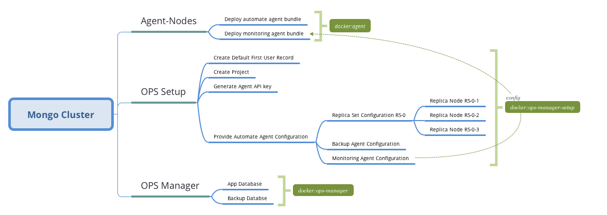

# MongoDB Infrastructure



General purpose is to deploy MongoDB database infrastructure managed by MMC OPS Manager. This network is deployed with Docker containers. To complete fully-functional network, you have to deploy at Deploy OPS Manager container and 3 MongoDB Databases joined by Replica set .

1) Deploy OPS Manager
2) Setup prebuild configuration
3) Configure OPS Manager
4) Deploy 3 Replica nodes

## Hardware & software requirements

## Deploy OPS Manager

You need to create [instance](https://cloud.digitalocean.com/droplets/new?i=797764&size=s-2vcpu-4gb&region=sfo2&appId=30970148&type=applications) based on Docker App or with installed Docker in it.


```shell
# Pull necessary files from bitbucket repository
git clone -b ops-manager https://bitbucket.org/membrana-io/mongodb-cluster.git
```

## Prebuild configuration

Database nodes management require 2 keys:

* User API key, that can be created at firt-user creation step
* Group ID, that created right after

### First user

By default automatic building creates first-user account that allows you to manage OPS Manager. First-user account credentials can be updated before deployment at `setup/post-unauth-users.json` file.

```json
{
  "username":     "admin",
  "emailAddress": "nobody@manhood.io",
  "password":     "{FIRST_USER_PASSWORD}",
  ...
}
```

Creating first-user account allows access all the other OPS Manager API with the generated API key, following with responce. This API Key automatically saved at `data/setup/user-api-key.txt` file.

### Default Project

Creating project is an necessary steg to get `groupId` value that allows us to create database nodes records with the generated project ID.

Group name can be updated before deployment at `setup/post-groups.json` file. Generated Group/Project ID stored at `data/setup/group-id.txt` file

```json
{
  "name": "Database Group Project"
}
```

### Automated node

Currently we have single automated node preconfigured by docker build at `/agent` directory. Build process needs `API_KEY_FILE` value accessible with proper Automated API key, that should be prepared by `ops-manager-setup` docker instance. Also it waits till OPS Manager API server is accessible and functional.

## Build

Automated building is driven by Docker. Building progress can take up to 20 minutes.

```shell
# Compose via docker-compose.yml configuration
docker-compose up -d
```

## Management

OPS Manager MMC Console accessed by following address:
[http://localhost:8080](http://localhost:8080/)

Credentials are specified above with First User deployment.

## Create Replica units

Base idea to provide database architecture with single replica set, that provides transaction features.

## Todo
